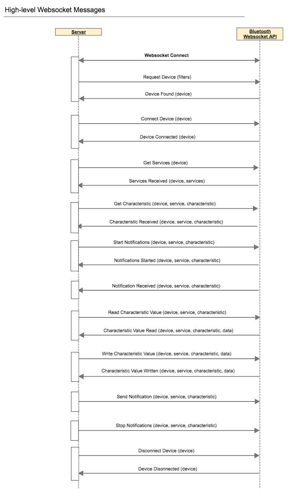

#BluetoothWebsocketAPI

## Description
 - Operate BLE devices from web browser and connect with server
 - Serve will be able to some command to operate BLE device

## Requirement

### For develop

#### - Frontend
- Node.js v5.4.0

#### - Backend
- Elixir / phoenix

### For testing application
- Android6.0+   or Chromebook
- Chrome v50+
- https only

## Features/Usage
  This library consists of three parts:

- core

  It has operation methods of BLE device.
  `device` object has service/characteristic objects as a properties to handle it.

- adapter

  It connects browser with server by using WebSocket.
  There are some send/receive event to handle data flow.

- app

  It depends on what you want, you can update as you like.

Following socket messages is provided.
 

For more detail of each socket event　→　soon

## Install

### To start your app
  Install node_module with `npm install`

### To use SSL on localhost with WebBluetoothAPI
  1. Generate key with `openssl genrsa -out localhost.key 2048`
  2. Generate cert with `openssl req -new -x509 -key localhost.key -out localhost.cert -days 3650 -subj /CN=localhost`
  3. Put them in a directory `/keys/`
  4. Start server with  `node server.js`

Now you can visit [`localhost:3000`](https://localhost:3000/app/) with SSL from your browser.

### To build js file when you update
  1. Update source file of `app/app/js'
  2. Run build with `npm run build`
  3. The file will be created to `dist/app.js`

### To start your HTTPS server on local:
  `node server.js`

Now you can visit [`localhost:3000/app`](https://localhost:3000/app) from your browser.
Of course you can use your apache server.

## Caution
- The value should be encoded with `base64` when you read/write value.
- `RequestDevice()` method should be fired by click event (due to WebBluetoothAPI specification).
- `characteristicvaluechanged` event is fired by after not only its value changes but also a value change notification/indication (due to WebBluetoothAPI specification).

## Licence

[MIT](LICENCE)

## Author

[HIGH MOBILITY](http://www.high-mobility.com/)
[Recruit Technologies](http://atl.recruit-tech.co.jp/en/) ([@tkybpp](https://github.com/tkybpp))